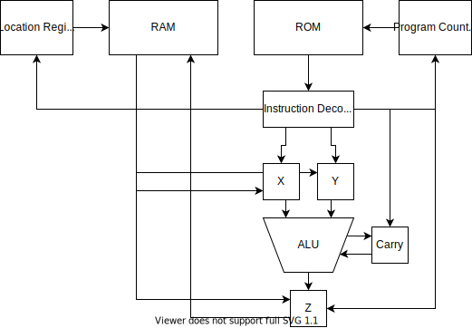

#  Pixel Brush Processing Unit
 The **Pixel Brush Processing Unit** (PBPU for short) is a simple 4-Bit CPU I designed in Logisim while I was still in school and had nothing better to do during Class.
 
 It's instruction set is thus extremely primitive.
 
 ### Instruction Set
 
Mnemonic| Inputs  | Name| Description |Added with Revision
:------:|:-------:|-----|-------------|---
NOP     |-        |No Operation|No operation is executed|Mk.1
ADD     |-        |Add|X and Y are added, the result is written to Z|Mk.1
SUB     |-        |Subtract|X and Y are subtracted, the result is written to Z|Mk.1
WT1     |0-15     |Write to Loc1[^1]|The given value is written to the upper 4 Bits of the Location Register|Mk.1
WT2     |0-15     |Write to Loc2[^2]|The given value is written to the lower 4 Bits of the Location Registern Register|Mk.1
WTX     |0-15     |Write to X|The given value is written to the X Register|Mk.1
WTY     |0-15     |Write to Y|The given value is written to the Y Register|Mk.1
WTZ     |0-15     |Write to Z|The given value is written to the Z Register|Mk.1
ZTR     |-        |Write Z to RAM|The contents of Z are put into the current RAM Location|Mk.1
RTZ     |-        |Read from RAM to Z|The contents of the selected RAM Location are put into the Z Register|Mk.1 (Revised in Mk.2)
PC1     |0-15     |Write to PC1[^3]|The given value is written to the upper 4 Bits of the PC[^5] Register|Mk.2
PC2     |0-15     |Write to PC2[^4]|The given value is written to the lower 4 Bits of the PC[^5] Register|Mk.2
JMP     |-        |Jump to PC[^5]|Transfers the Contents of the PC[^5] Register into the actual Program Counter, as long as the Z Register is 0|Mk.2
RTX     |-        |Read from RAM to X|The contents of the selected RAM Location are put into the X Register|Mk.3
RTY     |-        |Read from RAM to Y|The contents of the selected RAM Location are put into the Y Register|Mk.3
USC     |-        |Use Carry|Enables the usage of the Carry Bit for the next Arithmetic Operation|Mk.3

[^1]: RAM Location 1 (upper 4 bits)
[^2]: RAM Location 2 (lower 4 bits)
[^3]: Program Counter 1 (lower 4 bits)
[^4]: Program Counter 2 (upper 4 bits)
[^5]: Program Counter

# Assembler
I recently made a custom Assembler in Python for the PBPU Mk.4 according to this Instruction Set.

[PBPU Assembler](./PBPUassembler.py)
(Tested with Python 3.8)

Simply put your .asm file in as a Command-Line Argument and it should spit out an Assembled .bin file.

### Syntax Highlighting for Notepad++
[Just seems useful to have when Programming](./pbpuAssembly.xml)

### Examples
There's also a fully commented Program which puts a Smiley on the Mark 2's PPU Screen.

[PBPU Smiley (Assembly)](./examples/pbpuSmiley.asm)

[PBPU Smiley (Binary)](./examples/pbpuSmiley.asm.bin)

[Link to a Video Showcasing this Program on the Mark 2](https://twitter.com/pixel_brush/status/1390186715332153346?s=20)

### Important to remember when Programming
- You only have 256 Bytes of ROM, so your Program can't be bigger than that without a cheaty workaround
- Only 256 4-Bit Bytes of RAM (4 of which are reserved for the 4x4 Screen Matrix)
- Only 4-Bit Math
- No Input whatsoever (Unless one of the RAM Locations is used for it in some cheaty workaround way)

# History
### Original Goal
The original Goal was to design a simple, yet functional 4-Bit CPU that could execute simple Programs.

The PBPU had 3 iterations initially: The Mark 1, 2 and 3.

##### Pre-Mark 1 (3rd of May, 2021)
The first designs of the PBPU already contained the primary 4-Bit registers, X, Y and Z, alongside the Location Register. The 256 Bytes of RAM were also already being considered at this stage.

##### Mark 1 (3rd of May, 2021)
The Mark 1 was the first functional iteration of the CPU, only boasting the first 9 Instructions.
It could only really perform Mathmatical operations and save these to RAM.

##### Mark 2 (4th of May, 2021)
The Mark 2 expanded on the Mark 1's instruction set, extending it by 4 additional Instructions, meant to add Jumps and Conditionals to aid in the CPU being Turing Complete. However, it unfortunatley failed due to the JMP Command being rather buggy, not even properly checking the Status of the Z Register.

It also saw the introduction of the PBPU's Picture Processing Unit (PPU for short), a simple 4x4 LED Matrix that displayed 4 Bits as a single row of Pixels.
[Link to a Video Showcasing the Mk.2](https://twitter.com/pixel_brush/status/1390186715332153346?s=20)

##### Mark 3 (6th of May, 2021)
The last Iteration of the PBPU, the Mark 3, introduced the final 16 instructions, allowing to more easily load values into Registers for more complex operations.

The PPU was also expanded to use an 8x8 Grid, this was however scrapped due to it being too difficult to effectively write to.

Talks of a proper I/O interface came along but these never came to be.

##### Mark 4 (10th of November, 2021)
The Mark 4 is the latest Revision of the PBPU, meant to finally have it work exactly as intended.

It's still in the early stages of re-learning how a lot of the circuits in the old designs worked, especially due to the switch from Logisim Classic to Logisim Evolution.
I also no longer have access to the old Logisim Files, which makes this increasingly difficult.

##### Update (11th of November, 2021)
The Mark 4 appears to be functional, now supporting all originally inteded features!

It's messy, yes, but that can be worked out in the Mark 5.
It also no longer relies on a messy self-built decoder, allowing for each Clock Cycle to run one instruction.

The only currently known "bug" is the need for a NOP at the start of ROM, since the 1st Cylce Instruction is never loaded and executed.

Here's a Diagram to detail how it works

# Old Datasheet
This is the Datasheet where I hand-compiled my Programs and came up with all the Instructions
[(Old) PBPU Datasheet](./PBPUsheet.pdf)